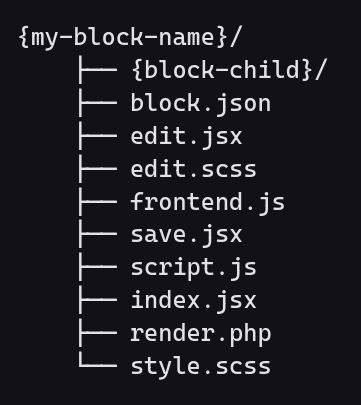
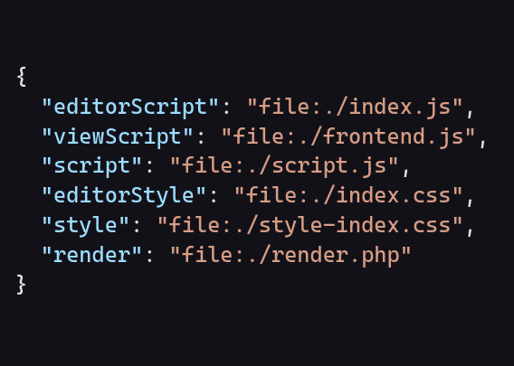

# Boilerplate de Tema para WordPress (Padrão ou FSE)

Este tema foi desenvolvido pela equipe da Apiki com alterações pela Makersoluções para ser utilizado com gabarito em sites padrão ou FSE (Full Site Editing). 

Ele inclui uma estrutura para criação de conjuntos de blocos Gutenberg.

O Readme deve ser atualizado com as informações do projeto caso seja modificado.

## Requisitos
- PHP 7.4 ou superior (Recomendado 8.1)
- Node 16.13.0 ou superior (Recomendado 19.7.0)
- NPM 8.1.0 ou superior (Recomendado 9.5.0)
- Yarn 1.22.15 ou superior (Recomendado 1.22.19)

## Instalação

1. Basta realizar um clone deste repositório dentro da pasta `wp-content/themes` do seu WordPress.

2. Modificar o nome do diretório para o nome do tema que deseja utilizar, por padrão o nome inicial esta como `execellent-child`.

3. Após isso, basta acessar o painel do WordPress e ativar o tema e começar a desenvolver.

A pasta ./docs serve apenas para documentação, caso não seja utilizada no projeto deve ser removida. 

Se o site não for um FSE exclua as pastas `templates`, `parts` e os arquivo `theme.json` e `/src/Controller/BlocksController.php` esses arquivos são utilizados apenas para FSE. Remova o `BlocksController` do Core.php.

## Estrutura de pastas

```
./                                     # → Raiz do tema
├── assets/                            # → Código-fonte dos assets do tema e admin
│   ├── admin/                         # → Assets para o painel administrativo
│   |   ├── scripts/
│   |   └── styles/
│   ├── fonts/                         # → Fontes
│   ├── images/                        # → Imagens
│   ├── lib/                           # → Arquivos de bibliotecas de terceiros
│   |   └── {lib_name}/                # → Nome da lib na pasta
│   ├── theme/                         # → Assets para o tema (front-end)
│   |   ├── external/
|	|	|	└── {lib_external}/        # → External para adicionar scss/js para conteúdos externos,
|	|	|	    |					   # → exp: adicionar um estilo customizado ao form do KAJABI (formulário de terceiro)
|	|	|		├── index.{js,scss}
|	|	|		└── files.{js,scss}
│   |   ├── scripts/
│   |   └── styles/
│   |       ├── Atoms/                 # → Estilos para componentes micros (que muito se repetem)
│   |       └── Base/                  # → Estilos base para o projeto (reset, variáveis, etc.)
│   ├── admin.js                       # → Root para os arquivos da pasta "admin"
│   └── theme.js                       # → Root para os arquivos da pasta "theme"
│
├── app/                               # → Código-fonte dos blocos Gutenberg
│   ├── components/                    # → Componentes reutilizáveis em geral
│   ├── examples/                      # → Prints dos blocos para o preview
│   ├── hooks/                         # → Hooks React? Filtros? Ambos?
│   ├── blocks/                        # → Blocos
│   │   ├── base/                      # → Os verdadeiros blocos reutilizáveis
│   │   └── {my-block-name}/
│   │       ├── {block-child}/         # → Blocos filhos, caso necessário
│   │       ├── block.json             # → Arquivo de configuração do bloco
│   │       ├── edit.jsx               # → Bloco para o editor
│   │       ├── edit.scss              # → Estilos de bloco SOMENTE para o editor
│   │       ├── frontend.js            # → JS somente para o front-end
│   │       ├── save.jsx               # → Bloco para o front-end (ESTÁTICO)
│   │       ├── script.js              # → JS tanto para o front-end quanto editor
│   │       ├── index.jsx              # → Registro do bloco no JS
│   │       ├── render.php             # → Bloco para o front-end (SERVER-SIDE / DINÂMICO)
│   │       └── style.scss             # → Estilos de bloco para o front-end e editor
│   └── _variables.scss                # → Mesmas variáveis do `theme/Base` porém para os blocos
│
├── parts/                             # → Template parts do FSE
│   ├── header.html                    # → Ex. header
│   ├── footer.html                    # → Ex. foooter
│   └── {name}.html                    # → Qualquer template part conforme a necessidade
│
├── theme-parts/                       # → Template parts padrão do WordPress
│   ├── header.php                     # → Ex. header
│   ├── footer.php                     # → Ex. foooter
│   └── {name}.php                     # → Qualquer template part conforme a necessidade
│
├── src/                               # → Back-end do projeto
│   ├── Controller                     # → Controllers (aqui são registrados os blocos no PHP automáticamente, registrar novos endpoints)
│   ├── Helper                         # → Helpers (funções que podem ser usadas em qualquer lugar do tema)
│   ├── Model                          # → Models (classes que representam entidades do banco de dados, ex: User, Post, etc.)
│   ├── Service                        # → Service (classes que representam serviços, ex: User, Post, etc.)
│   ├── Providers                      # → Providers ( query select customizadas, callback para endpoints registrados no Controllers)
│   ├── View                           # → View
│   └── Core.php                       # → Registra os controllers e inicializa o Carbon Fields
│   └── Loader.php                     # → Autoloader do back-end
│
├── templates/                         # → Templates do FSE
│   ├── index.html                     # → Template geral (obrigatório)
│   ├── single.html                    # → Ex. template de single genérica
│   └── {name}.html                    # → Qualquer template conforme a necessidade
│
├── functions.php                      # → Loader do tema (NÃO COLOCAR CÓDIGO POR AQUI)
├── jsconfig.json                      # → Configurações usadas principalmente para o path mapping
├── theme.json                         # → Configurações de tema do FSE (cores, fontes, on/off recursos)
├── package_fse.json                   # → Arquivo de configurações para site FSE
├── package_wp.json                    # → Arquivo de configurações para site WordPress Padrão
├── style.css                          # → Arquivo de registro do tema (NÃO COLOCAR CSS POR AQUI)
└── webpack.config.js                  # → Configurações customizadas do Webpack (usada para o path mapping)
```

---

```
 Sempre que possível, manentemos a mesma estrutura de pastas e se necessário documentar as atelrações.
```

## Back-end

Abaixo, vamos detalhar a estrutura de pastas do back-end.

Em primeiro lugar, vamos entender o que é o `src` e o `functions.php`. O `src` é o local onde ficam os arquivos e devemos utilizar OOP (Programação Orientada a Objetos) para desenvolver o projeto. 

O `functions.php` é o arquivo que carrega o tema e, por isso, não deve conter código. Ele deve apenas carregar o `src/Core.php`.

### src

A pasta `src` é a pasta onde ficam os arquivos do back-end. Ela é dividida em 5 pastas principais:

1. **Controller**: Aqui ficam os controllers. Um controller é um arquivo que registra um endpoint no WordPress. 
   Um exemplo de controller é o `src/Controller/BlockController.php`. Ele registra o endpoint `/wp-json/blocks/v1/blocks` e retorna todos os blocos registrados no projeto.
2. **Helper**: Aqui ficam os helpers. Um helper é um arquivo que contém funções que podem ser utilizadas em qualquer lugar do projeto. 
   Um exemplo de helper é o `src/Helper/BlockHelper.php`. Ele contém a função `get_blocks` que retorna todos os blocos registrados no projeto.
3. **Model**: Aqui ficam os models. Um model é um arquivo que contém uma classe que representa uma entidade do banco de dados. Um exemplo de model é o `src/Model/Block.php`. 
   Ele contém a classe `Block` que representa a entidade `block` do banco de dados.
4. **Service**: Aqui ficam os services. Um service é um arquivo que contém uma classe que representa um serviço. 
   Um exemplo de service é o `src/Service/BlockService.php`. Ele contém a classe `BlockService` que representa o serviço de blocos.
5. **View**: Aqui ficam as views. Uma view é um arquivo que contém o HTML de uma página. Um exemplo de view é o `src/View/BlockView.php`. 
   Ele contém a classe `BlockView` que representa a view de blocos.

**Core.php**: Ele inicializa o tema, carregando os controllers, hooks, filters, rest api e bibliotecas como o Carbon Fields.

**Loader.php**: O Loader é responsavel por instanciar as classes de Controllers do tema automaticamente.

**index.php**: O arquivo que impede o acesso direto ao diretório `src`.

**composer.json**: Contém as dependências do tema que são instaladas via composer.

---

## Front-end

Abaixo, vamos detalhar a estrutura de pastas do front-end.

### Assets

A pasta de `assets` segue um padrão similar ao anterior. A maior diferença está no grau de importante dos arquivos
contidos no `theme`, a adição da pasta `lib` e a remoção do `blocks`. Vamos por partes:

1. **Importância do `theme`**: esta pasta não é mais o foco principal dos arquivos de CSS e JS. Nela devem ser inseridos
   apenas aquilo considerado **EXTREMAMENTE** reutilizáveis. Uma espécie de guia para esse pensamente é a ideia de que
   devemos, por exemplo, limitar o CSS até somente os ATOMOS. Aqui vão, por exemplo, classes de botões que podem ser
   utilizadas em toda a aplicação, containers, separadores, e toda classe extremamente genérica.

2. **Nova pasta `lib`**: o objetivo desta pasta é conter arquivos de bibliotecas de terceiros. Estes arquivos não serão
   importados dentro do arquivo root do tema, mas serão somente registrados no PHP (`wp_register_{style|script}`) e o
   seu `handle (id)` será passado no registro do bloco dentro do `block.json`. Desta forma garantimos que esta _lib_
   somente será carregada quando realmente for necessário ao algum bloco/seção.

3. **Nova pasta `external`**: o objetivo desta pasta é conter arquivos que vão adicionar estilos ou scripts para
   conteúdos de terceiros, exemplo: adicionar um estilo customizado que se repete dentro do site para os formulários do
   KAJABI. Estes arquivos não serão importados dentro do arquivo root do tema, mas serão somente registrados no
   PHP (`wp_register_{style|script}`) e o seu `handle (id)` será passado no registro do bloco dentro do `block.json`.
   Desta forma garantimos que esta _external_ somente será carregada quando realmente for necessário ao algum
   bloco/seção.

4. **Remoção da pasta `blocks`**: esta pasta foi movida para a raiz do tema por questões de registro automatizado, para
   deixar mais claro sua importância e reduzir o "nesting" das pastas, uma vez que poderá conter blocos dentro de
   blocos.

---

### Blocks

Principal local onde os devs front-end devem atuar. Aqui estaram contidos todos os blocos do tema, juntamente com CSS e
JS respectivos. Observando por pastas, temos o seguinte:

- **Components**: aqui podem ser adicionados qualquer componente em geral que venha a ser reutilizado dentro dos blocos.
  Estes **NÃO** são registrados como um bloco (se contém um `block.json` possívelmente será um `base`). São
  essencialmente componentes React. Podem ser componentes simples que são reutilizados nos blocos tanto para fins
  visuais como para implementação de funcionalidades (geralmente via inspector), como a adição de um seletor de imagens
  ou de links.

- **Hooks**: ainda não bem definido. A principio foi usado para hooks customizados do React (somente 1 na verdade),
  porém com o encontro de uma nova lib do WP para lidar com dados, acabou sendo removido e foram adicionados scripts de
  hooks do WP para a criação de estilos responsivos em todos os blocos.

- **Reusable Blocks**: Aqui vão os blocos. Cada pasta interna direta representa um bloco, devendo conter
  um `block.json`. A única exceção é a `blocks-base` que contém os blocos genéricos da aplicação, sendo geralmente itens
  pequenos que até mesmo buscam substituir blocos que já existem no WP para melhorar a experiência de desenvolvimento.
  Um exemplo é o bloco de _Botão_, que possui configurações relacionadas ao estilo do projeto, além de ser mais simples
  de lidar no desenvolvimento.

Aqui há também o `_variables.scss`. Este contém os mesmos valores contidos no `/theme/styles/Base/_Variables.scss`. O
único objetivo é simplificar a importação do arquivo dentro do CSS de cada bloco, uma vez que os mesmos não são
naturalmente capazes de visualizar as variáveis do arquivo de tema devido ao build ser separado.

---

### Estrutura de um bloco

As imagens abaixo apresentam a estrutura de um bloco com todos os principais arquivos possíveis (esquerda) e o registro
de cada um destes arquivo no `block.json` (direita).

<p align="center">
  
  &nbsp;&nbsp;&nbsp;&nbsp;
  
</p>

### Função de cada arquivo

- `block.json`: registra as configurações do bloco. Muita coisa pode ser feita por aqui, sendo adicionado, entre outros,
  número da versão, nome, descrição, tags, atributos, suportes, relação com outros blocos (parent e ancestor) e registro
  dos scripts do bloco. Destaco aqui o uso do `supports` no qual temos funcionalidades interessantes já implementadas
  pelo WP, como a adição de seletores de cor de texto e fundo e classes extras para o bloco.

- `index.jsx`: Registro do bloco no javascript **(obrigatório)**.

- `edit.scss`: Estilos de um bloco utilizados SOMENTE no editor. Um exemplo interessante é o de sliders, onde o script
  só é adicionado no front, e no editor é criado um estilo mínimo para o bloco ser visualizado no editor.

- `style.scss`: Estilos de bloco para o front-end e editor

- `frontend.js`: Javascript adicionado somente para o front-end. Novamente um exemplo são os sliders, onde queremos
  executar o Javascript da ferramenta somente dentro do front-end.

- `script.js`: Javascript adicionado tanto no front-end quanto editor.

- `edit.jsx`: Componente React para renderizar o bloco no editor **(obrigatório)**.

- `save.jsx`: Componente React para renderizar o bloco no front-end. Neste arquivo renderizamos o conteúdo ESTÁTICO de
  um bloco **(obrigatório caso não seja server-side)**.

- `render.php`: Conteúdo do bloco para o front-end renderizado no servidor, ou seja, blocos com conteúdo dinâmico **(
  obrigatório se o bloco for totalmente server-side)**. Anteriormente era necessário o registro do bloco no php,
  utilizando o `render_callback`. Neste arquivo teremos acesso a três variáveis, sendo estas:
    - `$attributes (array)`: Atributos do bloco
    - `$content (string)`: Conteúdo estático de bloco. Quando estamos utilizando um bloco misto entre dinâmico e
      estático, o conteúdo retornado do `save.js` vira para esta variável, sendo necessário apenas "printarmos" seu
      conteúdo.
    - `$block (WP_Block)`: Instância do bloco.

### Registros no `block.json`

Alguns arquivos devem ser "registrados" dentro do `block.json` para o correto funcionamento.

- `editorScript`: registra o arquivo de registro do bloco (`index.jsx`).
- `viewScript`: registra o arquivo de JS usado somente no front-end.
- `script`: registra o arquivo de JS usado tanto no front-end quanto no editor.
- `editorStyle`: registra o arquivo de CSS usado somente no editor.
- `style`: registra o arquivo de CSS usado tanto no front-end quanto no editor.
- `render`: registra o callback para blocos dinâmicos (server-side).

## LINKS UTEIS

- [Lista de Utilitários](./docs/utils.md)

## ChangeLog
- 1.0.1
    - 10/04/2023 - Alterações realizadas Controller, blocks.
      - Renomeado a pasta blocks para app e reusable-blocks para blocks.
      - Alterado Core.php para realizar apenas o carregamento dos controllers e inicialização do carbons fields.
      - EnqueueScripts.php adicionado para realizar enqueue de scripts, styles e scripts direto no `wp_head`.
      - ThemeOptionsController.php responsável por adicionar qualquer tipo de suporte ao tema.
      - BlocksController.php responsável por realizar o carregamento dos blocos Gutenberg.
- 1.0.0
    - 06/04/2023 - Versão inicial com atualizado composer.json, package.json, documentação e estrutura de pastas.

## Creditos

- [Alexandre Almeida](https://github.com/xandy3br)
- [Marcos Ribeiro](https://github.com/marcosribeirodacunha)
- [Victor Felipe Oliveira](https://github.com/victor-felipe-code)
